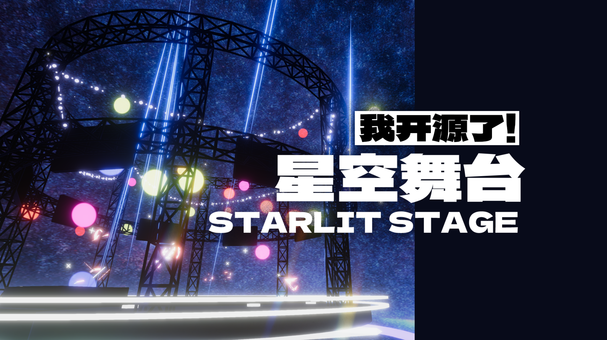

# RyuuJiWarudoMods

[中文](README.md) | [English](README_EN.md)

This is an open-source repository for publishing Warudo / Unity mods.

I use this repository to organize and share scenes, effects, and extension features built for [Warudo](https://warudo.app/). The current content is mainly designed for Unity URP, but it can also be used in other Unity URP LTS-based projects with minor adjustments.

I am also sorting and refining some older assets, which will be added to this repository over time. In parallel, I am preparing Unity / Godot development frameworks, game templates, and other independent software projects.

Because a full Unity project usually contains a large amount of cache and project metadata, this repository does not include the full project directly. Instead, content is distributed as importable `.unitypackage` files.

## Current Content

### RyuujiSceneNo59

`RyuujiSceneNo59` is a stylized space stage scene featuring visual effects, Volume settings, dynamic objects, and interactive content controlled through the accompanying Playground script.



Asset path:

```text
Scenes/RyuujiSceneNo59/RyuujiSceneNo59.unitypackage
```

Key features:

- Stylized space stage environment.
- URP visual effects and Volume configuration.
- Dynamic objects and controllable particle effects.
- `AutoAnime`: a concise and reusable procedural animation component.
- `DynamicPar`: a particle system control component designed for Warudo.

## Usage

1. Download or clone this repository.
2. Open your Warudo / URP project in Unity.
3. Import the target `.unitypackage`.
4. Check the `readme.md` inside the scene folder for Unity, uMod, and dependency requirements.

Recommended environment for `RyuujiSceneNo59`:

- Unity `2021.3.45f2`
- uMod `2.9.0` or newer
- Unity Render Pipeline: URP

## License and Attribution

The main content of this repository is released under the MIT License. You are free to use, modify, and distribute it.

Some packages may include third-party open-source or licensed assets. Their sources, authors, and licenses should be documented in the corresponding `readme.md` file under each asset folder. Please follow the original license terms when using them.

Although the MIT License does not require attribution, I would sincerely appreciate it if you credit `KatouRyuuji` or link back to this repository.

## Contact and Support

Technical exchange and collaboration are welcome, including Unity, Unreal Engine, Godot, software development, virtual production, and motion capture related topics.

- GitHub: [KatouRyuuji](https://github.com/KatouRyuuji)
- Bilibili: [KatouRyuuji on Bilibili](https://space.bilibili.com/445111)
- Email: 1984211921@qq.com

There is no donation channel at the moment. If you like this project, starring the repository or following my Bilibili account is the best way to support it.
